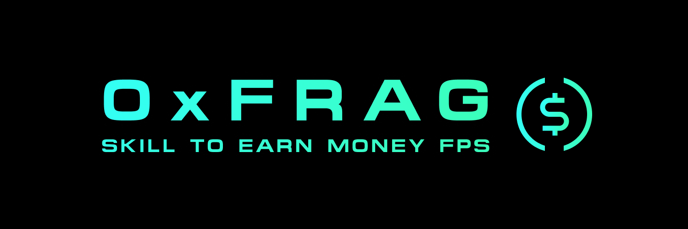

# 0xFRAG FPS Client


The official client for **0xFRAG** — a multiplayer FPS built from scratch with no game engine. Vanilla JS + Three.js rendering, Rust networking via Tauri 2, WebTransport over QUIC for sub-frame latency.

[](https://discord.gg/0xfrag)
[](https://0xfrag.com)

---

## Why This Client?

The browser version works fine, but the native client removes browser limitations:

- **No pointer lock banner** — the browser shows "Press ESC to show your cursor" every time you click. The native client uses OS-level mouse capture, no notification, no interruption.
- **Native performance** — no browser overhead, direct GPU access via the system webview.
- **Better input handling** — raw mouse deltas from the OS (via tao), bypassing browser mouse acceleration quirks.
- **Auto-updates** — coming soon.

---

## Tech Stack

| Layer | Tech |
|---|---|
| Window / System | [Tauri 2](https://tauri.app/) (Rust) |
| Rendering | [Three.js](https://threejs.org/) 0.170 — no game engine |
| Networking | [WebTransport](https://developer.mozilla.org/en-US/docs/Web/API/WebTransport) (QUIC/UDP) via [wtransport](https://crates.io/crates/wtransport) |
| Build | [Vite](https://vitejs.dev/) + Cargo |
| Protocol | Custom binary — 14 bytes input, 9+35N bytes world state, 60 Hz |

The entire renderer is vanilla JavaScript. No React, no framework, no bundled game engine. Three.js handles WebGL, everything else (physics, networking, prediction, HUD) is hand-written.

---

## Architecture

```
┌──────────────────────────────────────┐
│            Tauri (Rust)              │
│  ┌────────────────────────────────┐  │
│  │  WebTransport (wtransport)     │  │
│  │  Binary protocol encode/decode │  │
│  │  OS mouse capture (tao)        │  │
│  └──────────┬─────────────────────┘  │
│             │ Tauri events           │
│  ┌──────────▼─────────────────────┐  │
│  │  Webview (system)              │  │
│  │  Three.js renderer             │  │
│  │  Client-side prediction (60Hz) │  │
│  │  HUD / Chat / Laser sight      │  │
│  └────────────────────────────────┘  │
└──────────────────────────────────────┘
         │                    ▲
    input (14B)          world state (9+35N B)
    datagrams              datagrams
         │                    │
         ▼                    │
   ┌─────────────────────────────────┐
   │       Stream Server (Rust)      │
   │  Authoritative physics (60 Hz)  │
   │  Server-side hit detection      │
   │  Anti-wallhack (per-player vis) │
   └─────────────────────────────────┘
```

---

## Modding (Coming Soon)

0xFRAG is being built with modding in mind. Planned features:

- **Custom maps** — JSON-based map format, create and share your own arenas
- **Custom skins** — player model textures
- **Game modes** — server-side mode system, community modes via plugins
- **Client-side scripting** — HUD mods, custom crosshairs, visual tweaks

The map format is already open (JSON with typed blocks), and the rendering pipeline is designed to be extensible. Join the [Discord](https://discord.gg/0xfrag) to follow modding development and share ideas.

---

## Download

Grab the latest build from [Releases](https://github.com/0xFRAG/FPS-Client/releases):

| Platform | Format |
|---|---|
| Windows | `.msi` / `.exe` (NSIS) |
| macOS | `.dmg` |
| Linux | `.deb` / `.AppImage` |

---

## Build from Source

**Prerequisites:** Rust stable, Node.js 22+, pnpm

```bash
git clone https://github.com/0xFRAG/FPS-Client.git
cd FPS-Client
pnpm install
pnpm tauri build
```

Binaries end up in `src-tauri/target/release/bundle/`.

### Linux system deps (Ubuntu/Debian)

```bash
sudo apt install libwebkit2gtk-4.1-dev libgtk-3-dev libglib2.0-dev \
  libsoup-3.0-dev libjavascriptcoregtk-4.1-dev \
  libayatana-appindicator3-dev librsvg2-dev patchelf
```

---

## Links

- **Website:** [0xfrag.com](https://0xfrag.com)
- **Discord:** [discord.gg/0xfrag](https://discord.gg/0xfrag)
- **Issues:** [GitHub Issues](https://github.com/0xFRAG/FPS-Client/issues)
